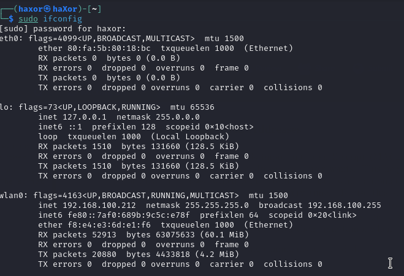
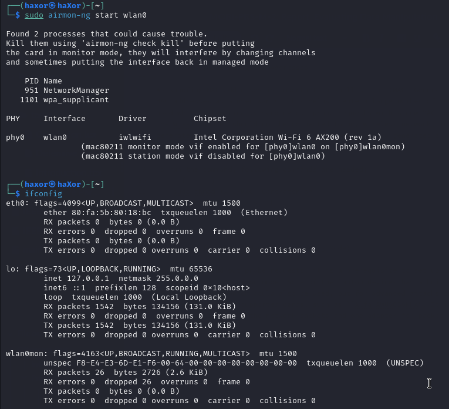
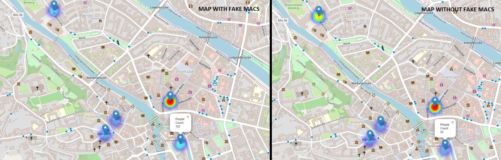
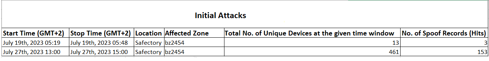
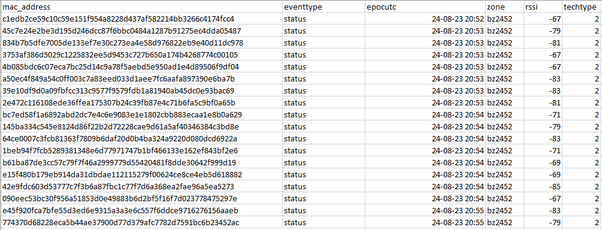

# CrowdAnym

**CrowdAnym-Offensive**: A cybersecurity project developed in collaboration between the [University of Bamberg](https://www.uni-bamberg.de/en/forschung/wissenschaftl-einrichtungen/forschungs-labs/smart-city-research-lab/translate-to-1-english-projektarchiv/translate-to-1-english-crowdanym/) and the [University of Washington](https://www.uwb.edu/news/2023/10/13/researching-security-and-privacy-for-smart-cities), focused on sensor vulnerability testing and penetration testing of wireless networks. Sponsored by [BMDV](https://bmdv.bund.de/SharedDocs/DE/Artikel/DG/mfund-projekte/crowdanym.html), [Stadt Bamberg](https://smartcity.bamberg.de/2023/08/24/crowdanym-misst-via-sensoren-wie-voll-es-in-bamberg-ist/), and Safectory GmbH, it includes tools for generating spoofed MAC addresses, setting adapters to monitor mode, and executing attack scripts.

<h2>Generating MAC Addresses</h2>
<li>In order to proceed with the injection attack, a spoof MAC addresses generator is needed; thus, a shell script (MAC_Generator.sh) is created to generate as many MAC addresses as a user wants. This helps create a large number of MAC addresses, which could be further used while automatically sending out probe requests with a new MAC address every time. While using this script, the Wi-Fi adapter should not be connected to any wireless network to function correctly. The script generates a text file containing MAC addresses and a .CSV file, which includes all MAC addresses with their timestamp when they were created. To run the script, the following commands are needed;</li>
</ul><ul>
</ul>
<code >sudo chmod +x ./MAC_Generator.sh</code>
<ul>
</ul>

<code >sudo ./MAC_Generator.sh </code>

<h2>Wireless Adapter - Monitor Mode</h2>
<li>In order to send out probe requests, it is a prerequisite to set up the wireless adapter or the built-in wireless card to monitor mode. Some laptop devices have a built-in wireless card with monitor mode functionality, which could also be used. However, advanced attacks like Scapy-based scripts need “packet injection” supported cards, such as "Alfa AWUS036NHA". It is better to use two adapters, one for separately monitoring the network packets and one adapter for packet injection, to analyze the data later. To enable the monitor mode, the following commands are needed;</li>
</ul>

<code >sudo airmon-ng start *interface name eg. wlan0*</code>
<ul>
</ul>
<ul>

</ul>
<h2>Attacking Scripts</h2>
<li>To run the attacking scripts, select the desired script, give execution permission (chmod+x) and run it. Make sure to edit Wi-Fi interface in code with your own interface. Scapy script needs wireless management details, to run and transmit probe requests properly.</li>
</ul>
<h2>Query</h2>
<li>Query could be made after running the "Hash_Generator.py" script to create SHA-224 hashes of the given "MACs.txt file. Make sure to edit "Salt" value inside the hash generator (a space before salt value is mandatory). Afterwards, "query_script.py" could be run to create query_text. Query script also needs hardcoded tweaks. </li>
</ul>
<h2>Screenshots</h2>
</ul><ul>

</ul><ul>

For any questions or feedback, please reach out to:

- **Syed Ibrahim Khalil**: [syedibrahimkhalil@protonmail.com](mailto:syedibrahimkhalil@protonmail.com)
- **Website**: www.syedibrahimkhalil.com
- **Github**: www.github.com/SYEDIBRAHIMKHALIL

